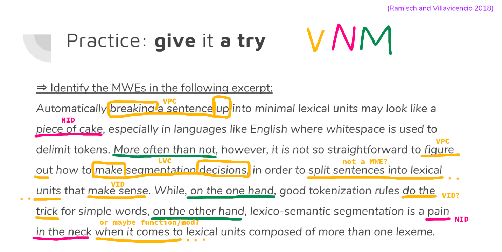

# Course 2: MWE annotation

## Lecture 1: basic concepts
- [slides](https://docs.google.com/presentation/d/1pb83jk2FAvQko88mQ24POaF2oncr0UhcWOR9wXDwWKg/) (with interactively added multilingual examples)

### Definitions 
MWE =
  - sequence of words that acts as a single unit at some level of linguistic analysis (Calzolari et al. 2002)
  - lexical item that
    - can be decomposed into multiple lexemes
    - display lexical, syntactic, semantic, pragmatic... idiomaticity
    - combination of at least 2 words that echibit idiosyncrasies at various linguistic levels (most prominently, semantic non-compositionality)
- types of idiosyncrasies:
  - lexical
  - morphological
  - syntactical
  - semantical
  - pragmatical
- MWEs $\neq$ collocations (the latter is a statistical concepts) 
  > yet, for something to be a MWE it has to be established - but what about the cases where they serve me a _cold dog_ (=cold hot dog)?

### MWEs in NLP
- tasks:
  - discovery (text $\to$ lexicon, typically with a human in the loop)
  - identification (text $\to$ annotated text)
- challenges:
  - statistical measures are not always effective (cf. frequent but non idiosyncratic expressions)
  - distance between constituents can be long
  - overlapping MWEs:
    - factorization
    - nesting
- methods:
  - rule-based
  - statistical
  - trad. ML-based
  - deep learning-based

## Lecture 2: annotation
- [full documentation](https://parsemefr.lis-lab.fr/parseme-st-guidelines/1.2/)
- two-step process:
  1. PIE (Potentially Idiomatic Expression) identification (based on native speaker intuition)
  2. classification according to unified guidelines (using a decision tree, such as the one for [verbs](https://parsemefr.lis-lab.fr/parseme-st-guidelines/1.2/?page=040_Annotation_process_-_decision_tree)) 
- multi-token words are not PIEs, but multi-word tokens can be (whatever that means)
- distinguish lexicalized items vs. open slots (= parts of the MWE that can vary)
- classification based on POS tag
  - verbal
    - `LVC` - Light Verb Constructions (_give a lecture_)
    - `VID` - Verbal IDioms (_go bananas_)
    - `IRV` - Inherently Reflexive Verbs (_find oneself in a difficult situation_)
    - `VPC` - Verb-Particle Constructions (`.full`: _give up_ = surrender, `.semi`: _eat up_ (semi-compositional))
  - nominal:
    - `NID` - Nominal IDioms (_pecora nera_)
    - `VMWENom` - Nominalizations of verbal VMWEs (_decision making_)
  - modifier (ADJ, ADV) (WIP)
  - functional (WIP)
  - pronominal

### Annotation exercise

## Session 3: annotation
Questions:

- LVC vs VID? __LVCs are slightly more compositional and the meaning comes from the noun, which is the "semantic head"__
- is the POS the POS of the phrase or the POS of the head constituent? __Of the phrase__
- how to remove an annotation? __NotMWE or blank in dropdown menu__