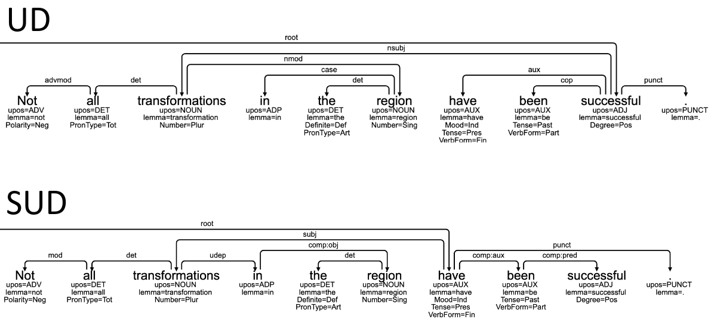
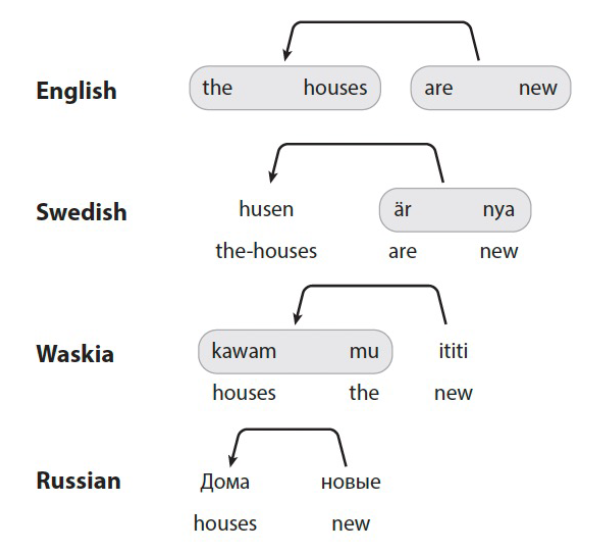
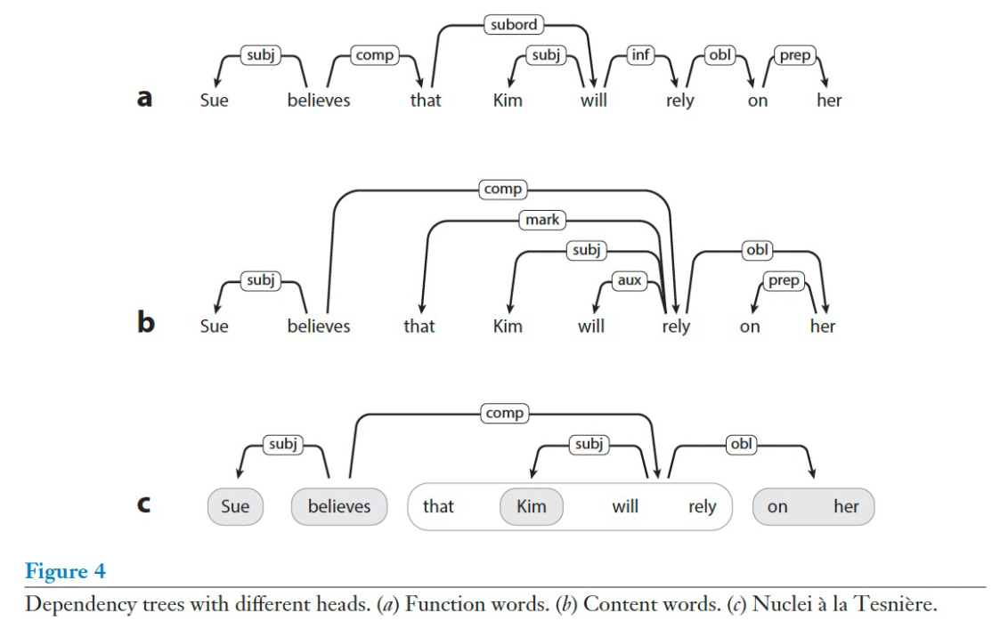

# Course 1: dependency syntax

## Lecture 1: basics of querying and annotation

### [Grew-match](https://universal.grew.fr/)

#### Grew-match vs STUnD queries

| semantics | Grew-match | STUnD |
| --- | --- | --- |
| auxiliaries | `pattern { x[upos = AUX] }` | `UPOS "AUX"` |
| instances of "vara" used as auxiliaries | `pattern { x[upos = AUX, lemma = "vara"] }` | `AND [UPOS "AUX", LEMMA "vara"]` |
| copulas with nouns as complements | `pattern { X -[cop]->Y; X[upos = NOUN] }` | `TREE_ (UPOS "NOUN") [DEPREL "cop"]`

#### Clustering
- [simple clustering](https://universal.grew.fr/?custom=668bfaea521cd)
- [double clustering](https://universal.grew.fr/?custom=668bfa38e1c93)

### [Arborator grew](arboratorgrew.elizia.ne)
Annotation tool (too cryptic buggy if you ask for my first impression).
## Lecture 2
- [slides](https://unidive.lisn.upsaclay.fr/lib/exe/fetch.php?media=meetings:other-events:1st-training-school:treebanks-moldava2024-class1.pdf) (historical overview goes much further back than Tesniere)
- typometrics:
  - [website](https://typometrics.elizia.net/#/)
  - [paper](https://www.glossa-journal.org/article/id/5397/)

## Lecture 3

### General concepts
- dependency annotation as a 3-layer task:
  1. connections (does not need the notion of sentence)
  2. arrows (=dependencies, ~syntactic heads)
  3. relation labels

### SUD wrt UD

- purely distributional criteria (unlike UD)
- richer (but somewhat harder) annotation
- same POS and FEATS, different structures and DEPRELs
- automatic conversions possible
- no primacy of content words in SUD: connections are not btw content words but rather btw _nuclei_ (=content words with function words, Tesnière 1959):
  - 
  - function vs content vs nucleus heads: 
- tries to address 3 UD problems (at the expense of cross-lingual comparability):
  - definition of content word
  - loss of connectedness of syntactic units
  - dealing with head-marking langs - relation markers can be:
    - standalone: _il cane __di__ Pietro_
    - on the dependent: _**Peters** hund_
    - on the head: _**xaju** Peer bi_ (Wolof)